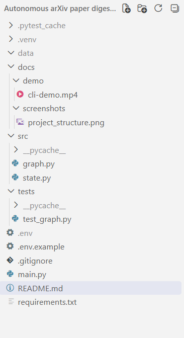

# 📄 Autonomous arXiv Paper Digest & QA Agent

### 🤖 Agentic AI · RAG · LangGraph · arXiv · Grounded QA

  
  
  
  

  
  
  
  

**Retrieve → Parse → Embed → Brief → Ask**

*A stateful agentic AI system for autonomous research-paper analysis and grounded question answering.*

---

## 🌟 Overview

**Autonomous arXiv Paper Digest & QA Agent** is a stateful **agentic AI application**
that automates the process of retrieving, processing, understanding, and querying
research papers from **arXiv**.

The system accepts a **research topic, arXiv paper ID, or arXiv URL**, processes the
selected paper, generates an **executive briefing**, and answers user questions using
**retrieved content from the paper as the grounding source**.

<table>
<tr>
<td align="center" width="25%">

### 🔎

**Retrieve**

Find relevant research papers from arXiv.

</td>
<td align="center" width="25%">

### 📄

**Process**

Download, parse, chunk and embed the paper.

</td>
<td align="center" width="25%">

### 📝

**Brief**

Generate a structured executive briefing.

</td>
<td align="center" width="25%">

### 💬

**Ask**

Answer questions using paper evidence.

</td>
</tr>
</table>

---

## 🎯 Problem Statement

Research papers contain valuable information but can be difficult to analyze quickly,
especially when the goal is to understand the **problem, approach, results, limitations,
and implications** without reading the entire paper first.

This project builds an automated workflow that can:

| # | Capability |
|---|---|
| 01 | 🧠 Understand the user's input |
| 02 | 🔎 Retrieve relevant papers from arXiv |
| 03 | 🎯 Select an appropriate paper |
| 04 | 📥 Download and parse the PDF |
| 05 | ✂️ Split the paper into meaningful chunks |
| 06 | 🧬 Generate embeddings and store them |
| 07 | 📝 Generate an executive briefing |
| 08 | 💬 Answer questions using paper content |
| 09 | 🛡️ Handle failures through conditional routing |

---

<h2>💡 Solution</h2>

The system combines <strong>agent orchestration, generative AI, and retrieval-augmented
generation (RAG)</strong> into one stateful workflow.

<strong>The system uses:</strong>

<ul>
  <li>🧠 <strong>LangGraph</strong> for stateful agent orchestration</li>
  <li>🔎 <strong>arXiv API</strong> for paper retrieval</li>
  <li>📄 <strong>PyMuPDF</strong> for PDF extraction</li>
  <li>🧬 <strong>Sentence Transformers</strong> for embeddings</li>
  <li>🗄️ <strong>ChromaDB</strong> for vector storage</li>
  <li>🤖 <strong>Google Gemini</strong> for summarization and QA</li>
</ul>

<h3>Input</h3>

Users can provide:

<pre>
🔎 Research topic
🆔 arXiv paper ID
🔗 arXiv paper URL
</pre>

<h3>Output</h3>

The agent produces:

<table>
<tr>
<td align="center" width="45%">

<h3>📝</h3>

<strong>Executive Briefing</strong>

Structured understanding of the selected research paper.

</td>

<td align="center" width="10%">

<h2>+</h2>

</td>

<td align="center" width="45%">

<h3>💬</h3>

<strong>Grounded Paper QA</strong>

Question answering using retrieved paper content.

</td>
</tr>
</table>

<h2>🎬 Example Run</h2>

The following CLI recording demonstrates the complete workflow:
<strong>paper input → paper processing → executive briefing → grounded QA → grounded fallback</strong>.

  

  <em>CLI demonstration of paper analysis and grounded question answering</em>

<<h2>📁 Project Structure</h2>

<pre>
arxiv-agent/

├── src/
│   ├── graph.py
│   └── state.py
│
├── tests/
│   └── test_graph.py
│
├── docs/
│   └── demo/
│       └── cli-demo.gif
│
├── main.py
├── README.md
├── requirements.txt
├── .env.example
└── .gitignore
</pre>

  <em>Actual project structure of the CLI-based agent</em>

  

<h3>🔄 End-to-End Flow</h3>

<pre>
                         👤 USER
                           │
                           ▼
                  ┌─────────────────┐
                  │  Input Handling │
                  └────────┬────────┘
                           │
                           ▼
                  🔎 arXiv Retrieval
                           │
                           ▼
                    🎯 Paper Selection
                           │
                           ▼
                    📄 PDF Processing
                           │
                           ▼
                    ✂️ Chunk + Embed
                           │
                           ▼
                     🗄️ ChromaDB
                           │
                    ┌──────┴──────┐
                    ▼             ▼
             📝 Executive      💬 QA
                Briefing        Loop
                                  │
                                  ▼
                         🔍 Retrieve Chunks
                                  │
                                  ▼
                            🤖 Gemini
                                  │
                                  ▼
                         ✅ Grounded Answer
</pre>

<h2>🤖 Agentic AI + GenAI + RAG</h2>

<table>
<tr>

<td align="center" width="33%">

<h3>🤖 Agentic AI</h3>

<strong>LangGraph</strong>

The workflow is represented as a state graph with nodes, edges,
shared state, and conditional routing.

</td>

<td align="center" width="33%">

<h3>🧠 GenAI</h3>

<strong>Google Gemini</strong>

Gemini generates the executive briefing and produces answers
from retrieved paper evidence.

</td>

<td align="center" width="33%">

<h3>🔎 RAG</h3>

<strong>ChromaDB + Embeddings</strong>

Relevant paper chunks are retrieved before the QA generation step,
keeping responses grounded in the selected paper.

</td>

</tr>
</table>

 

<blockquote>
<strong>In short:</strong>
LangGraph orchestrates the workflow,
Gemini provides the generative intelligence,
and RAG provides the grounding.
</blockquote>

<h2>🏗️ System Architecture</h2>

<pre>
┌──────────────────────┐
│      👤 USER         │
│   Topic / ID / URL   │
└──────────┬───────────┘
           │
           ▼
┌──────────────────────┐
│ 🧠 Understand Query  │
└──────────┬───────────┘
           │
           ▼
┌──────────────────────┐
│ 🔎 Retrieve from     │
│       arXiv          │
└──────────┬───────────┘
           │
           ▼
┌──────────────────────┐
│ 🎯 Select Paper      │
└──────────┬───────────┘
           │
           ├──────── error ────────► END
           │
           ▼
┌──────────────────────┐
│ 📥 Fetch + Parse PDF │
└──────────┬───────────┘
           │
           ├──────── error ────────► END
           │
           ▼
┌──────────────────────┐
│ ✂️ Chunk + Embed     │
└──────────┬───────────┘
           │
           ├──────── error ────────► END
           │
           ▼
┌──────────────────────┐
│ 🗄️ ChromaDB          │
│   Vector Store       │
└──────────┬───────────┘
           │
           ▼
┌──────────────────────┐
│ 📝 Executive Brief   │
└──────────┬───────────┘
           │
           ▼
        END
           │
           │ Processed state
           ▼
┌──────────────────────┐
│ 💬 User Question     │
│      QA Loop         │
└──────────┬───────────┘
           │
           ▼
┌──────────────────────┐
│ 🔍 Retrieve Chunks   │
└──────────┬───────────┘
           │
           ▼
┌──────────────────────┐
│ 🤖 Gemini Grounded   │
│        QA            │
└──────────┬───────────┘
           │
           ▼
      ✅ Answer
</pre>

<h2>🧩 Agent Workflow</h2>

The main processing workflow is implemented as an explicit
<strong>LangGraph state graph</strong>.

<pre>
START
  │
  ▼
Understand Query
  │
  ▼
Retrieve arXiv Papers
  │
  ▼
Select Paper
  │
  ├──────────── error ────────────► END
  │
  ▼
Fetch + Parse PDF
  │
  ├──────────── error ────────────► END
  │
  ▼
Chunk + Embed
  │
  ├──────────── error ────────────► END
  │
  ▼
Generate Executive Briefing
  │
  ▼
END
</pre>

<h3>💬 QA Loop</h3>

The QA stage uses the processed paper state and performs semantic retrieval
from the paper-specific vector store before generating the answer.

<pre>
User Question
      │
      ▼
Semantic Retrieval
      │
      ▼
Relevant Paper Chunks
      │
      ▼
Grounded Gemini Prompt
      │
      ▼
Paper-Based Answer
</pre>

<h2>🔄 Retrieval-Augmented Generation</h2>

The RAG pipeline follows:

<pre>
📄 Paper PDF
     │
     ▼
📑 PyMuPDF
     │
     ▼
📃 Extracted Text
     │
     ▼
✂️ Recursive Chunking
     │
     ▼
🧬 Sentence Transformer
     │
     ▼
🗄️ ChromaDB
     │
     ▼
🔍 Semantic Retrieval
     │
     ▼
📚 Relevant Paper Chunks
     │
     ▼
🤖 Gemini
     │
     ▼
💬 Grounded Answer
</pre>

 

<table>
<tr>
<td>

<strong>🛡️ Grounding Rule</strong>

  

The QA system is instructed to use the retrieved paper content rather than
unsupported outside information.

  

If the requested information cannot be found in the paper, the system responds:

  

<strong>"The information is not available in the paper."</strong>

</td>
</tr>
</table>

<h2>📝 Executive Briefing</h2>

For each successfully processed paper, the agent generates:

<table>
<thead>
<tr>
<th>#</th>
<th>Section</th>
</tr>
</thead>

<tbody>

<tr>
<td>01</td>
<td>📌 Title</td>
</tr>

<tr>
<td>02</td>
<td>👥 Authors</td>
</tr>

<tr>
<td>03</td>
<td>🆔 arXiv ID</td>
</tr>

<tr>
<td>04</td>
<td>📅 Date</td>
</tr>

<tr>
<td>05</td>
<td>🔗 Link</td>
</tr>

<tr>
<td>06</td>
<td>💡 Plain-English Summary</td>
</tr>

<tr>
<td>07</td>
<td>🎯 Problem</td>
</tr>

<tr>
<td>08</td>
<td>⚙️ Approach</td>
</tr>

<tr>
<td>09</td>
<td>📊 Key Results</td>
</tr>

<tr>
<td>10</td>
<td>⚠️ Limitations</td>
</tr>

<tr>
<td>11</td>
<td>❓ Follow-up Questions</td>
</tr>

</tbody>
</table>

The briefing is generated from the selected paper's content and metadata.

<h2>🧠 Shared Agent State</h2>

The workflow uses a shared state object that is passed between LangGraph nodes.

<table>
<tr>
<td><code>user_input</code></td>
<td>User-provided topic, paper ID, or URL</td>
</tr>

<tr>
<td><code>input_type</code></td>
<td>Identified input type</td>
</tr>

<tr>
<td><code>query</code></td>
<td>Normalized search query or paper identifier</td>
</tr>

<tr>
<td><code>candidate_papers</code></td>
<td>Candidate papers retrieved from arXiv</td>
</tr>

<tr>
<td><code>selected_paper</code></td>
<td>Selected paper metadata</td>
</tr>

<tr>
<td><code>paper_metadata</code></td>
<td>Paper metadata used during processing</td>
</tr>

<tr>
<td><code>paper_text</code></td>
<td>Extracted PDF text</td>
</tr>

<tr>
<td><code>chunks</code></td>
<td>Processed paper chunks</td>
</tr>

<tr>
<td><code>vector_store</code></td>
<td>ChromaDB collection used for retrieval</td>
</tr>

<tr>
<td><code>retrieved_chunks</code></td>
<td>Chunks retrieved for a question</td>
</tr>

<tr>
<td><code>briefing</code></td>
<td>Generated executive briefing</td>
</tr>

<tr>
<td><code>question</code></td>
<td>User's QA question</td>
</tr>

<tr>
<td><code>answer</code></td>
<td>Generated grounded answer</td>
</tr>

<tr>
<td><code>conversation_history</code></td>
<td>Reserved state field for conversational context</td>
</tr>

<tr>
<td><code>error</code></td>
<td>Error information used for routing</td>
</tr>
</table>

This allows each node to consume information produced by previous stages while
maintaining a stateful workflow.

<h2>🧩 Node & Function Responsibilities</h2>

<table>
<thead>
<tr>
<th>Node / Function</th>
<th>Responsibilities</th>
</tr>
</thead>

<tbody>

<tr>
<td>🧠 <code>understand_query</code></td>
<td>Determines whether input is a topic, paper ID, or arXiv URL</td>
</tr>

<tr>
<td>🔎 <code>retrieve_arxiv</code></td>
<td>Retrieves candidate papers using the official arXiv API</td>
</tr>

<tr>
<td>🎯 <code>select_paper</code></td>
<td>Selects the most relevant candidate using deterministic lexical scoring</td>
</tr>

<tr>
<td>📥 <code>fetch_parse</code></td>
<td>Downloads and extracts text from the selected PDF</td>
</tr>

<tr>
<td>✂️ <code>chunk_embed</code></td>
<td>Splits text, generates embeddings, and stores them in ChromaDB</td>
</tr>

<tr>
<td>📝 <code>summarize</code></td>
<td>Generates the executive briefing</td>
</tr>

<tr>
<td>🔍 <code>retrieve_chunks</code></td>
<td>Retrieves semantically relevant chunks for a question</td>
</tr>

<tr>
<td>💬 <code>qa</code></td>
<td>Generates a grounded answer using retrieved paper content</td>
</tr>

</tbody>
</table>

<h2>🛡️ Error-Aware Routing</h2>

The agent does not blindly continue when a previous stage fails.

<table>
<thead>
<tr>
<th>Situation</th>
<th>Handling</th>
</tr>
</thead>

<tbody>

<tr>
<td>🔎 No arXiv results</td>
<td>Stops with a clear no-results message</td>
</tr>

<tr>
<td>🌐 arXiv retrieval failure</td>
<td>Returns the retrieval error</td>
</tr>

<tr>
<td>📄 Paper not selected</td>
<td>Stops before PDF processing</td>
</tr>

<tr>
<td>📥 PDF download failure</td>
<td>Stops the workflow</td>
</tr>

<tr>
<td>📑 PDF parsing failure</td>
<td>Stops the workflow</td>
</tr>

<tr>
<td>📃 Insufficient extracted text</td>
<td>Rejects unusable PDF content</td>
</tr>

<tr>
<td>✂️ Chunking failure</td>
<td>Stops before summarization</td>
</tr>

<tr>
<td>💬 QA information unavailable</td>
<td>Returns a grounded fallback response</td>
</tr>

</tbody>
</table>

<h3>Example</h3>

<pre>
No papers were found on arXiv for the given query.
</pre>

For unsupported QA questions:

<pre>
The information is not available in the paper.
</pre>

<h2>🛠️ Technology Stack</h2>

<table>
<thead>
<tr>
<th>Layer</th>
<th>Technology</th>
</tr>
</thead>

<tbody>

<tr>
<td>🐍 Language</td>
<td>Python</td>
</tr>

<tr>
<td>🤖 Agent Framework</td>
<td>LangGraph</td>
</tr>

<tr>
<td>🧠 LLM</td>
<td>Google Gemini</td>
</tr>

<tr>
<td>🔎 Paper Retrieval</td>
<td>Official arXiv API</td>
</tr>

<tr>
<td>📄 PDF Processing</td>
<td>PyMuPDF</td>
</tr>

<tr>
<td>✂️ Text Splitting</td>
<td>LangChain Text Splitters</td>
</tr>

<tr>
<td>🧬 Embeddings</td>
<td>Sentence Transformers</td>
</tr>

<tr>
<td>🗄️ Vector Database</td>
<td>ChromaDB</td>
</tr>

<tr>
<td>🖥️ Interface</td>
<td>CLI</td>
</tr>

<tr>
<td>🧪 Testing</td>
<td>Pytest</td>
</tr>

<tr>
<td>🔧 Development</td>
<td>VS Code</td>
</tr>

<tr>
<td>🌱 Version Control</td>
<td>Git + GitHub</td>
</tr>

</tbody>
</table>

<h2>🚀 Installation &amp; Setup</h2>

<h3>1️⃣ Clone the Repository</h3>

<pre>
git clone &lt;https://github.com/laxmibagodi/autonomous-arxiv-paper-digest-and-QA-agent.git&gt;
cd autonomous-arxiv-paper-digest-and-QA-agent
</pre>

<h3>2️⃣ Create a Virtual Environment</h3>

<pre>
python -m venv .venv
</pre>

<h4>Windows PowerShell</h4>

<pre>
.venv\Scripts\Activate.ps1
</pre>

<h4>Windows CMD</h4>

<pre>
.venv\Scripts\activate
</pre>

<h3>3️⃣ Install Dependencies</h3>

<pre>
pip install -r requirements.txt
</pre>

<h2>🔐 Environment Configuration</h2>

Create a <code>.env</code> file in the project root:

<pre>
GOOGLE_API_KEY=your_google_api_key
</pre>

The <code>.env</code> file is excluded from Git through
<code>.gitignore</code>.

A template is provided:

<pre>
.env.example
</pre>

<h2>🖥️ Running the Application</h2>

<h2>🖥️ Running the Application</h2>

<h3>CLI Mode</h3>

The agent is designed as a lightweight command-line application.

<pre>
python main.py
</pre>

The CLI accepts:

<ul>
<li>🔎 A natural-language research topic</li>
<li>🆔 An arXiv paper ID</li>
<li>🔗 An arXiv paper URL</li>
</ul>

<ul>
<li>⚙️ after giving input, the system Analyzes the paper.</li>
<li>📝 displays the executive briefing.</li>
<li>💬 then, an interactive QA loop is available.</li>
<li>we can ask questions about the paper and ✅ Receive grounded answers.</li>
</ul>

Type:

<pre>
exit
</pre>

to quit.

<h2>🧪 Example Inputs</h2>

<table>
<thead>
<tr>
<th>Input Type</th>
<th>Example</th>
</tr>
</thead>

<tbody>

<tr>
<td>🔹 arXiv Paper ID</td>
<td><code>1706.03762</code></td>
</tr>

<tr>
<td>🔹 arXiv URL</td>
<td>
<a href="https://arxiv.org/abs/1706.03762">
https://arxiv.org/abs/1706.03762
</a>
</td>
</tr>

<tr>
<td>🔹 Research Topic</td>
<td><code>retrieval augmented generation</code></td>
</tr>

</tbody>
</table>

<h2>🧪 Testing</h2>

Automated tests are included using <strong>pytest</strong>.

Run:

<pre>
python -m pytest
</pre>

<h3>Test Coverage</h3>

<ul>
<li>✅ Topic input detection</li>
<li>✅ arXiv ID detection</li>
<li>✅ arXiv URL detection</li>
<li>✅ Paper selection</li>
<li>✅ Paper ranking</li>
<li>✅ Existing error preservation</li>
<li>✅ Conditional routing</li>
<li>✅ Missing paper handling</li>
<li>✅ Missing paper text handling</li>
</ul>

<h2>💡 Key Design Decisions</h2>

<h3>1. 🧠 LangGraph for Explicit State Management</h3>

LangGraph makes the workflow visible through:

<ul>
<li>Nodes</li>
<li>Edges</li>
<li>Conditional routing</li>
<li>Shared state</li>
</ul>

This makes the agent easier to reason about and debug.

<h3>2. 🎯 Deterministic Paper Selection</h3>

Candidate papers are ranked using deterministic lexical matching rather than
arbitrary LLM selection.

This makes paper selection reproducible.

<h3>3. 🗄️ Paper-Specific Vector Collections</h3>

Each processed arXiv paper receives its own ChromaDB collection.

This prevents chunks from different papers from being mixed during retrieval.

<h3>4. 🛡️ Grounded QA</h3>

The QA prompt explicitly restricts the model to retrieved paper content.

When information is unavailable, the system uses a fixed fallback response
rather than inventing an answer.

<h3>5. 🔀 Conditional Failure Routing</h3>

Each major processing stage can stop the workflow when an error occurs.

This prevents downstream nodes from operating on incomplete state.

<h2>⚠️ Limitations</h2>

<ul>
<li>Processes one selected paper at a time.</li>
<li>arXiv retrieval depends on API availability.</li>
<li>PDF extraction quality depends on the source PDF structure.</li>
<li>The current vector store exists within the running application process.</li>
<li>No model fine-tuning is performed.</li>
<li>No authentication is implemented.</li>
<li>No persistent multi-user storage is implemented.</li>
<li>
Complex PDF layouts, scanned documents, tables, and mathematical formatting
may not always extract perfectly.
</li>
</ul>

<h2>🔮 Future Improvements</h2>

Potential extensions include:

<ul>
<li>🔎 Improved query understanding and paper ranking</li>
<li>📚 Multi-paper comparison</li>
<li>🗄️ Persistent vector storage</li>
<li>🔗 Citation-aware answers</li>
<li>📊 Better table and mathematical-content extraction</li>
<li>🧠 Longer conversation memory</li>
<li>🤖 More advanced agent planning and tool selection</li>
<li>📏 Retrieval and answer-quality evaluation datasets</li>
<li>☁️ Hosted deployment</li>
</ul>

<h2>✅ Project Status</h2>

<table>
<thead>
<tr>
<th>Component</th>
<th>Status</th>
</tr>
</thead>

<tbody>

<tr>
<td>🧠 Query Understanding</td>
<td>🟢 Complete</td>
</tr>

<tr>
<td>🔎 arXiv Retrieval</td>
<td>🟢 Complete</td>
</tr>

<tr>
<td>🎯 Paper Selection</td>
<td>🟢 Complete</td>
</tr>

<tr>
<td>📥 PDF Download</td>
<td>🟢 Complete</td>
</tr>

<tr>
<td>📑 PDF Text Extraction</td>
<td>🟢 Complete</td>
</tr>

<tr>
<td>✂️ Text Chunking</td>
<td>🟢 Complete</td>
</tr>

<tr>
<td>🧬 Embeddings</td>
<td>🟢 Complete</td>
</tr>

<tr>
<td>🗄️ ChromaDB Storage</td>
<td>🟢 Complete</td>
</tr>

<tr>
<td>📝 Executive Briefing</td>
<td>🟢 Complete</td>
</tr>

<tr>
<td>💬 Grounded QA</td>
<td>🟢 Complete</td>
</tr>

<tr>
<td>🛡️ Error Routing</td>
<td>🟢 Complete</td>
</tr>

<tr>
<td>🧪 Automated Tests</td>
<td>🟢 Complete</td>
</tr>

<tr>
<td>📖 Documentation</td>
<td>🟢 Complete</td>
</tr>

</tbody>
</table>

<h2>🚀 Project Highlights</h2>

<table>
<tr>

<td align="center" width="33%">

<h3>🤖 Agentic Workflow</h3>

Stateful LangGraph

</td>

<td align="center" width="33%">

<h3>🔎 Grounded Retrieval</h3>

RAG + ChromaDB

</td>

<td align="center" width="33%">

<h3>🛡️ Failure Handling</h3>

Conditional Routing

</td>

</tr>

<tr>

<td align="center">

<h3>📄 Paper Understanding</h3>

Executive Briefing

</td>

<td align="center">

<h3>💬 Interactive QA</h3>

Paper-Grounded Answers

</td>

<td align="center">
<h3>💻 CLI Interaction</h3>

Lightweight Interface

</td>

</tr>
</table>

<h2>📌 Project Status</h2>

<h3>🟢 Technical Assessment Implementation Complete</h3>

The system currently supports the complete workflow from:

<strong>
User Input → Paper Retrieval → PDF Processing → Vector Retrieval
→ Executive Briefing → Grounded QA
</strong>

<h2>📄 Autonomous arXiv Paper Digest &amp; QA Agent</h2>

<strong>Retrieve · Understand · Ground · Answer</strong>

Built with 🐍 Python · 🤖 LangGraph · 🧠 Gemini · 🔎 arXiv ·
🗄️ ChromaDB 

